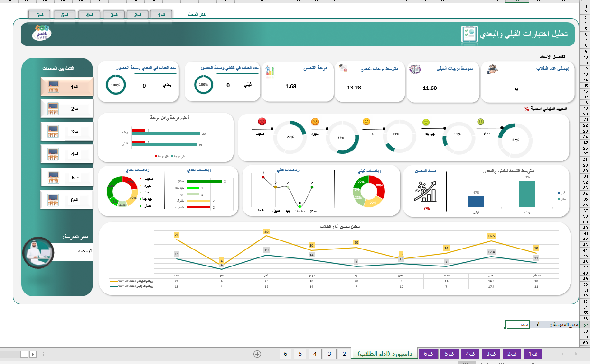

# NAFS Students Test Analysis Dashboard

An interactive educational analytics project developed for the **NAFS Platform** to monitor, evaluate, and analyze students’ academic performance across multiple classes through connected dashboards and dynamic reporting.

---

# Project Overview

This project provides a comprehensive analytical solution for tracking and evaluating student assessment performance using interactive Excel dashboards.

The system focuses on:

- Pre-test and post-test analysis
- Measuring improvement rates
- Monitoring student achievement levels
- Comparing class performance
- Identifying educational trends and insights

The dashboards were designed to support educational decision-making through clear and professional data visualization.

---

# Project Structure

The project consists of:

## Dashboards
- 6 Interactive Connected Dashboards
- Each dashboard represents a separate class
- Dynamic navigation between dashboards

## Data Sheets
- 6 Dedicated Data Sheets
- Each sheet contains class-specific student data
- Connected to all dashboard visuals and KPIs

---

# Key Features

✅ Interactive dashboards  
✅ Dynamic KPI cards  
✅ Connected class reports  
✅ Pre-test vs Post-test comparison  
✅ Student performance distribution analysis  
✅ Improvement percentage tracking  
✅ Monthly performance trends  
✅ Modern educational dashboard UI  
✅ Easy class navigation system  
✅ Data-driven educational insights  

---

# KPIs Included

The dashboards monitor important educational metrics such as:

- Total Students
- Average Pre-Test Score
- Average Post-Test Score
- Improvement Rate
- Success Percentage
- Achievement Level Distribution
- Highest & Lowest Scores
- Performance Trend Analysis

---

# Tools & Technologies

- Microsoft Excel
- Pivot Tables
- Pivot Charts
- Slicers
- Conditional Formatting
- Advanced Excel Formulas
- Interactive Dashboard Design

---

# Project Objectives

The dashboard solution helps the **NAFS Platform** to:

- Track students’ academic progress
- Evaluate learning effectiveness
- Compare class performance
- Detect weak and outstanding students
- Support educational reporting and analytics
- Improve data-driven decision-making

---

# Dashboard Preview

---

# Insights Generated

The dashboards provide insights into:

- Overall improvement rates
- Student achievement levels
- Class performance comparisons
- Learning progress trends
- Areas requiring educational support

---

# About This Repository

This repository showcases a professional educational analytics solution developed for the **NAFS Platform**, transforming raw assessment data into meaningful insights through interactive dashboards and modern data visualization.

---
